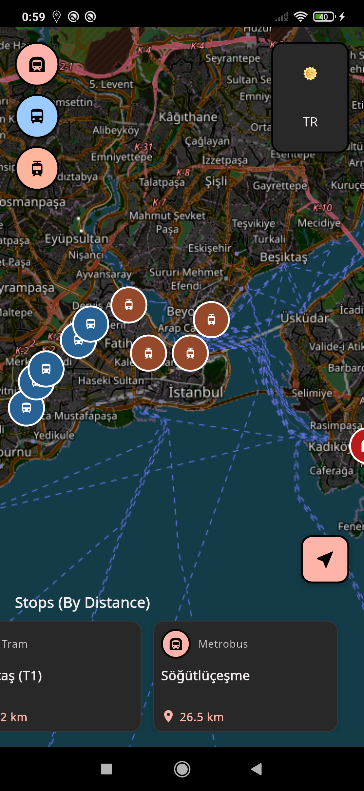
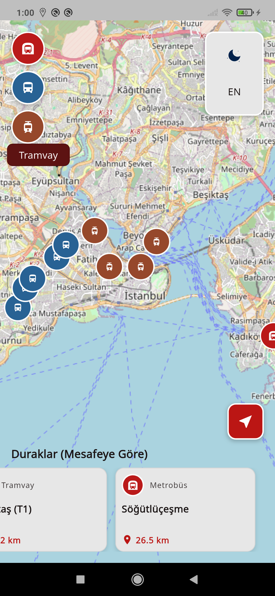
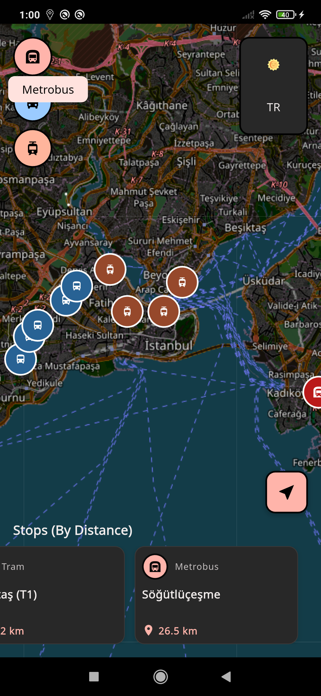
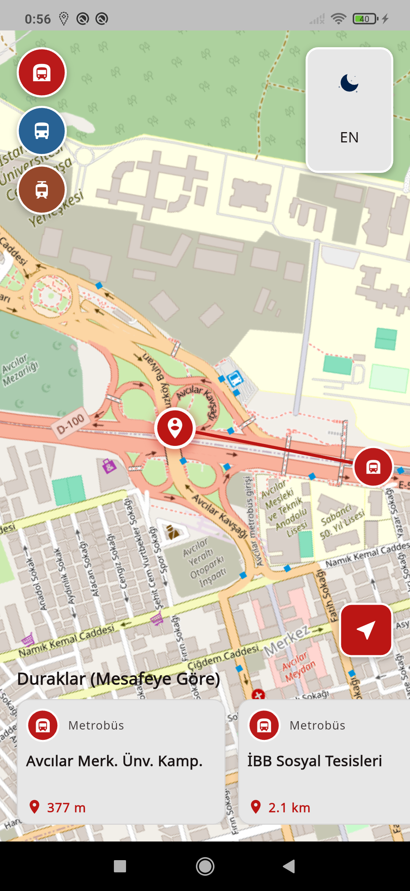
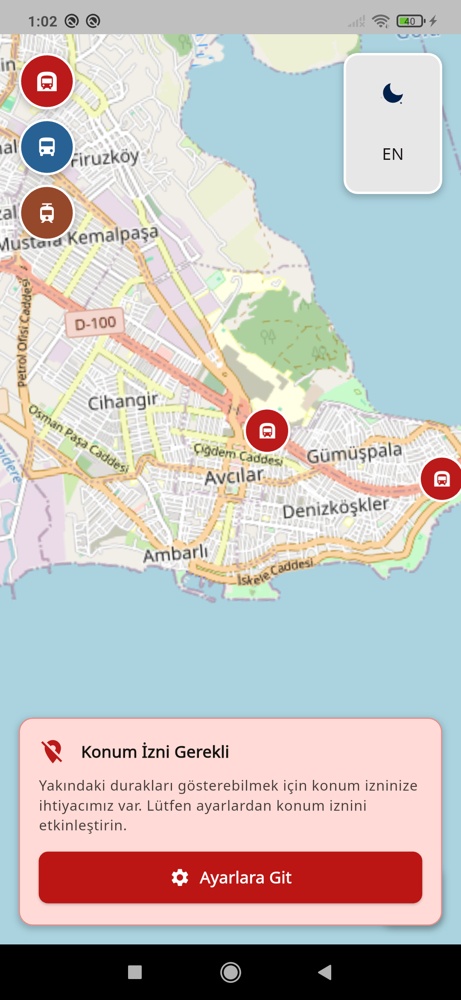
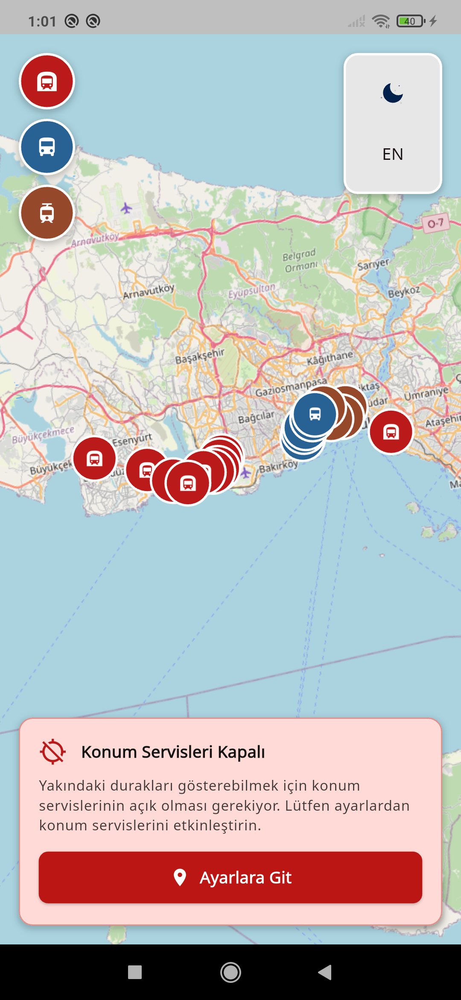

# Altur Yakın Duraklar / Altur Nearby Stops

İstanbul'da yakın toplu taşıma duraklarını bulan Flutter uygulaması. Gerçek zamanlı konum servisleri ve rota görselleştirmesi içerir.

Flutter application for finding nearby public transportation stops in Istanbul with real-time location services and route visualization.

---

## 📦 APK İndir / Download APK

**Dosya**: [Link](https://github.com/hesty/altur_nearby_stops/raw/refs/heads/main/apk/app-release.apk) `apk/app-release.apk` (23MB)

---

## 🇹🇷 Türkçe

### Proje Amacı
Altur study case'i için geliştirilmiş İstanbul toplu taşıma durak bulucu uygulaması. Kullanıcıların konumlarına göre yakındaki otobüs, metrobüs ve tramvay duraklarını harita üzerinde gösterir.

### Temel Özellikler
- **Harita Entegrasyonu**: OpenStreetMap ile interaktif harita
- **Konum Takibi**: GPS tabanlı gerçek zamanlı konum
- **Durak Filtreleme**: Otobüs, metrobüs, tramvay görünürlük kontrolü
- **Mesafe Hesaplama**: Yakın durakları mesafeye göre sıralama
- **Rota Çizimi**: Kullanıcı konumundan durağa polyline çizimi
- **Çoklu Dil**: Türkçe/İngilizce destek
- **Tema Desteği**: Açık/koyu mod

### Teknik Mimari

#### State Management
- **Provider Pattern**: Reaktif state yönetimi
- **ChangeNotifier**: UI güncellemeleri için

#### Harita ve Konum
- **flutter_map**: ^8.1.1 - OpenStreetMap entegrasyonu
- **latlong2**: ^0.9.1 - Koordinat hesaplamaları
- **geolocator**: ^14.0.1 - GPS ve konum servisleri

#### UI Framework
- **Material Design 3**: Modern UI tasarım sistemi
- **flex_color_scheme**: ^8.2.0 - Gelişmiş tema sistemi (Case Özelinde Kullanıldı Gercek Projede Kullanilmayan Ihtiyac Yok)
- **google_fonts**: ^6.2.1 - Özel font desteği (Case Özelinde Kullanıldı Gercek Projede Kullanilmayan Ihtiyac Yok)

#### Navigasyon ve Lokalizasyon
- **go_router**: ^15.1.2 - Declarative routing
- **easy_localization**: ^3.0.7+1 - Çoklu dil desteği

### Kurulum

#### Gereksinimler
- Flutter SDK 3.8.0+
- Android Studio / VS Code
- Android cihaz/emülatör

#### Adımlar
```bash
git clone https://github.com/hesty/altur_nearby_stops.git
cd altur_nearby_stops
flutter pub get
flutter run
```

#### APK Build
```bash
flutter build apk --release
```

### Proje Yapısı
```
lib/
├── core/
│   ├── constants/     # Sabitler ve enum'lar
│   ├── extension/     # Extension metodları
│   ├── init/          # Uygulama başlatma
│   ├── provider/      # Global provider'lar
│   └── theme/         # Tema konfigürasyonları
└── view/map/
    ├── controller/    # Business logic
    ├── model/         # Data modeller
    ├── view/          # UI ekranları
    └── widget/        # Widget'lar
```


---

## 🇬🇧 English

### Project Purpose
Flutter application developed as an Altur case study. Displays nearby bus, metrobus, and tram stops on an interactive map based on user location in Istanbul.

### Key Features
- **Map Integration**: Interactive map with OpenStreetMap
- **Location Tracking**: Real-time GPS-based positioning
- **Stop Filtering**: Bus, metrobus, tram visibility control
- **Distance Calculation**: Nearby stops sorted by distance
- **Route Drawing**: Polyline from user location to stops
- **Multi-language**: Turkish/English support
- **Theme Support**: Light/dark mode

### Technical Architecture

#### State Management
- **Provider Pattern**: Reactive state management
- **ChangeNotifier**: UI updates

#### Map and Location
- **flutter_map**: ^8.1.1 - OpenStreetMap integration
- **latlong2**: ^0.9.1 - Coordinate calculations
- **geolocator**: ^14.0.1 - GPS and location services

#### Installation
```bash
git clone https://github.com/hesty/altur_nearby_stops.git
cd altur_nearby_stops
flutter pub get
flutter run
```


## 📱 Ekran Görüntüleri / Screenshots

### Harita Açılışı / Map Opening


### Ulaşım Filtreleme / Transport Filtering


### Durak Listesi / Stops List


### Rota Çizimi / Route Drawing


### Koyu Tema / Dark Theme


## Konum Servisi Gerekli Banner / Location Services Required Banner



## 👨‍💻 Geliştirici / Developer

**GitHub**: [@hesty](https://github.com/hesty)
**Proje**: Altur Study Case
